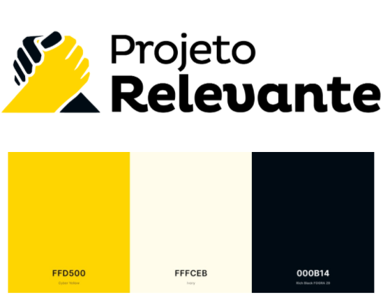

# Projeto Relevante 

## Sobre o Projeto Relevante
O nome Projeto Relevante, derivou da igreja que Gilberto Chagas e sua equipe frequentam, a chamada Igreja Relevante.

## Conheça a equipe:
* Andreia Britto e Yagnes Salomão | Desenvolvedoras Front-End;
* Ayumi Koge, Renny Murakami e Roni Campos | Designers UX/Ui;
* Gustavo Trindade, Caroline Pedrassani e Victor Leal | Growth Hacker;
* Felipe Tolentino e Georginton Oliveira | Inside Sales;

## Branding

Para a elaboração da identidade visual, utilizamos o arquétipo Prestativo de Carl G. Jung.
Utilizamos as fontes Pluto Bold e Regular. Uma tipografia sem serifa, e arredondada, que transmite conforto e confiança.
Para a cor principal, optamos pelo amarelo, que estimula o otimismo e a esperança, além de ser uma cor acolhedora. Já a cor preta foi utilizada com o intuito de neutralizar o amarelo, para que não fique muito cansativo a visão.

